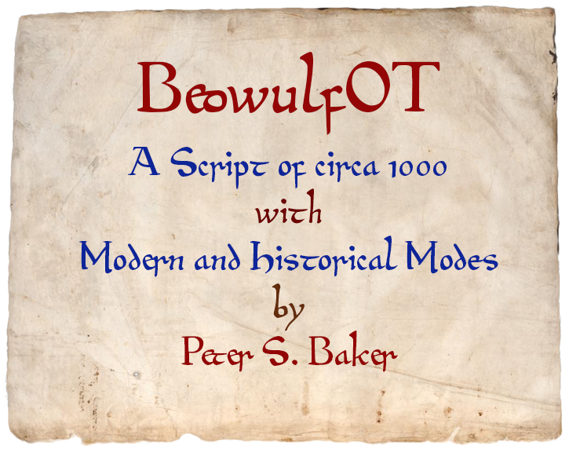

This is an updated version of the developer's widely-used BeowulfOne font.

By default, the font is in "modern" mode, employing letter-shapes that
are recognizable by modern readers. Turn on the OpenType hist (or ss16)
feature, and you will instead see something much more like what
the first scribe of the Beowulf manuscript (written ca. AD 1000) produced.

As this font is being migrated from FontForge to Glyphs, sources in both
formats are supplied.
